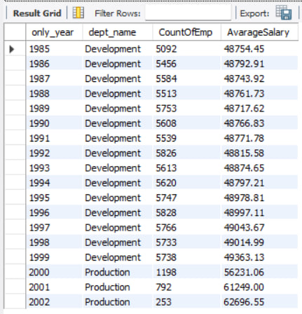
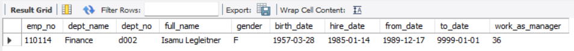
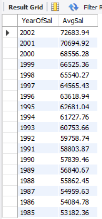
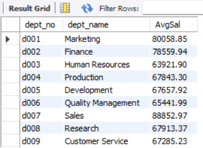
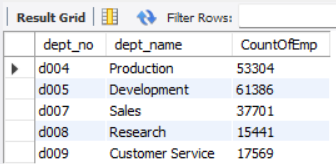
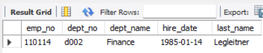
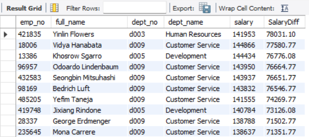
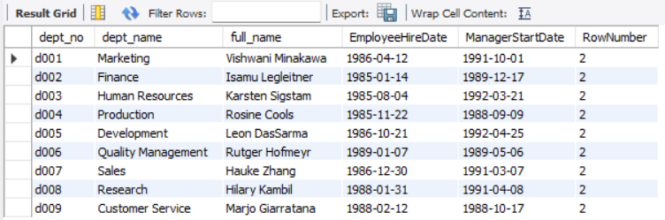
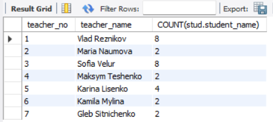
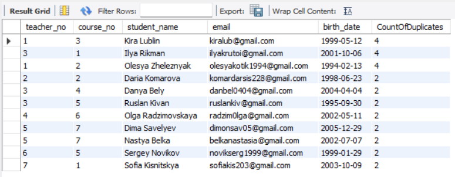

# SQL Step Project — Sofia Kucheruk

## 📌 Project Overview

This project contains a collection of SQL queries and database design tasks completed in **MySQL**.

The project is divided into two parts:

- **Part 1 — Employee Data Analysis**
- **Part 2 — Course Management Database**

---

# Part 1 — Employee Data Analysis

## Questions I Wanted to Answer From the Dataset

### 1. Which department was the largest in each year, and what was its average salary?

```sql
WITH dept_year AS (
    SELECT 
        dep.dept_name,
        EXTRACT(YEAR FROM deptemp.from_date) AS only_year,
        deptemp.emp_no
    FROM employees.dept_emp deptemp
    INNER JOIN employees.departments dep 
        ON deptemp.dept_no = dep.dept_no
),

salary_year AS (
    SELECT 
        sal.emp_no,
        EXTRACT(YEAR FROM sal.from_date) AS only_year,
        sal.salary
    FROM employees.salaries sal 
),

dept_sum AS (
    SELECT 
        dy.only_year,
        dy.dept_name,
        COUNT(DISTINCT dy.emp_no) AS CountOfEmp,
        AVG(sy.salary) AS AvgSal
    FROM dept_year dy
    INNER JOIN salary_year sy
        ON dy.emp_no = sy.emp_no 
       AND dy.only_year = sy.only_year
    GROUP BY dy.only_year, dy.dept_name
),

ranked AS (
    SELECT *,
           ROW_NUMBER() OVER (
               PARTITION BY only_year 
               ORDER BY CountOfEmp DESC
           ) AS rankbyemp
    FROM dept_sum
)

SELECT 
    only_year,
    dept_name,
    CountOfEmp,
    ROUND(AvgSal, 2) AS AvarageSalary
FROM ranked 
WHERE rankbyemp = 1
ORDER BY only_year;
```

**Result:**



---

### 2. Which current manager has been working in the position the longest?

```sql
SELECT emp.emp_no,
       dep.dept_name,
       deptman.dept_no,
       CONCAT(emp.first_name, " ", emp.last_name) AS full_name,
       emp.gender,
       emp.birth_date,
       emp.hire_date,
       deptman.from_date,
       deptman.to_date,
       TIMESTAMPDIFF(
           YEAR, 
           deptman.from_date, 
           CURRENT_DATE
       ) AS work_as_manager
FROM employees.employees emp
INNER JOIN employees.dept_manager deptman
    ON emp.emp_no = deptman.emp_no
INNER JOIN employees.departments dep
    ON deptman.dept_no = dep.dept_no
WHERE CURRENT_DATE BETWEEN deptman.from_date AND deptman.to_date
ORDER BY work_as_manager DESC 
LIMIT 1;
```

**Result:**



---

### 3. What was the average employee salary for each year before 2005?

```sql
SELECT 
    YEAR(sal.from_date) AS YearOfSal,
    ROUND(AVG(sal.salary), 2) AS AvgSal
FROM employees.salaries sal
WHERE sal.from_date < '2005-01-01'
GROUP BY YEAR(sal.from_date)
ORDER BY YEAR(sal.from_date) DESC;
```

**Result:**



---

### 4. What is the current average salary in each department?

The calculation is based on the employee's **current salary** and **current department**.

```sql
SELECT dept.dept_no,
       dept.dept_name,
       ROUND(AVG(sal.salary), 2) AS AvgSal
FROM employees.dept_emp deptemp
INNER JOIN employees.departments dept
    ON deptemp.dept_no = dept.dept_no
INNER JOIN employees.salaries sal
    ON deptemp.emp_no = sal.emp_no
    AND CURRENT_DATE() BETWEEN sal.from_date AND sal.to_date
WHERE CURRENT_DATE() BETWEEN deptemp.from_date AND deptemp.to_date
GROUP BY dept.dept_no,
         dept.dept_name
ORDER BY dept.dept_no ASC;
```

**Result:**



---

### 5. What was the average salary in each department for each year?

```sql
SELECT 
    deptemp.dept_no,
    YEAR(sal.from_date) AS YearOfSal,
    ROUND(AVG(sal.salary), 2) AS AvgSal
FROM employees.dept_emp deptemp
INNER JOIN employees.salaries sal
    ON deptemp.emp_no = sal.emp_no
GROUP BY deptemp.dept_no,
         YEAR(sal.from_date)
ORDER BY deptemp.dept_no ASC;
```

**Result:**


---

### 6. Which departments currently have more than 15,000 employees?

```sql
SELECT 
    deptemp.dept_no,
    dep.dept_name,
    COUNT(deptemp.emp_no) AS CountOfEmp
FROM employees.departments dep
INNER JOIN employees.dept_emp deptemp
    ON dep.dept_no = deptemp.dept_no
    AND CURRENT_DATE BETWEEN deptemp.from_date AND deptemp.to_date
GROUP BY deptemp.dept_no
HAVING COUNT(deptemp.emp_no) > 15000
ORDER BY deptemp.dept_no ASC;
```

**Result:**



---

### 7. Who is the longest-serving current manager?

```sql
SELECT 
    emp.emp_no,
    deptman.dept_no,
    dep.dept_name,
    emp.hire_date,
    emp.last_name
FROM employees.employees emp
INNER JOIN employees.dept_manager deptman
    ON emp.emp_no = deptman.emp_no
INNER JOIN employees.departments dep
    ON deptman.dept_no = dep.dept_no
WHERE CURRENT_DATE BETWEEN deptman.from_date AND deptman.to_date
ORDER BY emp.hire_date ASC
LIMIT 1;
```

**Result:**



---

### 8. Which 10 current employees have the largest difference between their salary and the average salary of their department?

```sql
WITH DeptAvgSalary AS (
    SELECT 
        deptemp.dept_no,
        AVG(sal.salary) AS AvgSalary
    FROM employees.dept_emp deptemp
    INNER JOIN employees.salaries sal
        ON deptemp.emp_no = sal.emp_no
        AND CURRENT_DATE BETWEEN deptemp.from_date AND deptemp.to_date
        AND CURRENT_DATE BETWEEN sal.from_date AND sal.to_date
    GROUP BY deptemp.dept_no
)

SELECT 
    emp.emp_no,
    CONCAT(emp.first_name, " ", emp.last_name) AS full_name,
    dep.dept_no,
    dep.dept_name,
    sal.salary,
    ROUND(
        ABS(sal.salary - depavgsal.AvgSalary),
        2
    ) AS SalaryDiff
FROM employees.employees emp
INNER JOIN employees.dept_emp deptemp
    ON emp.emp_no = deptemp.emp_no
INNER JOIN employees.departments dep
    ON deptemp.dept_no = dep.dept_no
INNER JOIN employees.salaries sal
    ON emp.emp_no = sal.emp_no
INNER JOIN DeptAvgSalary depavgsal
    ON deptemp.dept_no = depavgsal.dept_no
    AND CURRENT_DATE BETWEEN deptemp.from_date AND deptemp.to_date
    AND CURRENT_DATE BETWEEN sal.from_date AND sal.to_date
ORDER BY ABS(sal.salary - depavgsal.AvgSalary) DESC
LIMIT 10;
```

**Result:**



---

### 9. Who was the second manager of each department?

```sql
CREATE TEMPORARY TABLE IF NOT EXISTS employees.temp_manager
AS 
SELECT 
    dep.dept_no,
    dep.dept_name,
    CONCAT(emp.first_name, " ", emp.last_name) AS full_name,
    emp.hire_date AS EmployeeHireDate,
    deptman.from_date AS ManagerStartDate,
    ROW_NUMBER() OVER (
        PARTITION BY dep.dept_no 
        ORDER BY deptman.from_date
    ) AS RowNumber
FROM employees.employees emp
INNER JOIN employees.dept_manager deptman
    ON emp.emp_no = deptman.emp_no
INNER JOIN employees.departments dep
    ON deptman.dept_no = dep.dept_no;

SELECT *
FROM employees.temp_manager
WHERE RowNumber = 2;
```

**Result:**



---

# Part 2 — Course Management Database

## Database Design

The database was created to manage:

- Students
- Teachers
- Courses

### Database tables

**`teachers`**

- `teacher_no`
- `teacher_name`
- `phone_no`

**`courses`**

- `course_no`
- `course_name`
- `start_date`
- `end_date`

**`students`**

- `student_no`
- `teacher_no`
- `course_no`
- `student_name`
- `email`
- `birth_date`

### Creating the database

```sql
CREATE DATABASE IF NOT EXISTS course_system;

USE course_system;
```

### Creating the tables

```sql
CREATE TABLE IF NOT EXISTS teachers (
    teacher_no INT AUTO_INCREMENT PRIMARY KEY,
    teacher_name VARCHAR(100) NOT NULL,
    phone_no VARCHAR(50)
);

CREATE TABLE IF NOT EXISTS courses (
    course_no INT AUTO_INCREMENT PRIMARY KEY,
    course_name VARCHAR(100) NOT NULL,
    start_date DATE,
    end_date DATE
);

CREATE TABLE IF NOT EXISTS students (
    student_no INT AUTO_INCREMENT,
    teacher_no INT,
    course_no INT,
    student_name VARCHAR(100),
    email VARCHAR(255),
    birth_date DATE,
    PRIMARY KEY (student_no),

    FOREIGN KEY (teacher_no)
        REFERENCES teachers (teacher_no)
        ON UPDATE RESTRICT
        ON DELETE CASCADE,

    FOREIGN KEY (course_no)
        REFERENCES courses (course_no)
        ON UPDATE RESTRICT
        ON DELETE CASCADE
);
```

---

## Questions I Wanted to Answer From the Course Database

### 10. How many students has each teacher worked with?

```sql
SELECT 
    teach.teacher_no,
    teach.teacher_name,
    COUNT(stud.student_name)
FROM course_system.teachers teach
INNER JOIN course_system.students stud
    ON teach.teacher_no = stud.teacher_no
GROUP BY teach.teacher_no,
         teach.teacher_name
ORDER BY teach.teacher_no;
```

**Result:**



---

### 11. Which rows are duplicated in the `students` table?

First, three duplicate rows were intentionally added:

```sql
INSERT INTO students (
    teacher_no,
    course_no,
    student_name,
    email,
    birth_date
)
SELECT 
    teacher_no,
    course_no,
    student_name,
    email,
    birth_date
FROM course_system.students
LIMIT 3;
```

Then the duplicate rows were identified:

```sql
SELECT 
    teacher_no,
    course_no,
    student_name,
    email,
    birth_date,
    COUNT(*) AS CountOfDuplicates
FROM course_system.students
GROUP BY 
    teacher_no,
    course_no,
    student_name,
    email,
    birth_date
HAVING COUNT(*) > 1;
```

**Result:**



---

# 🛠️ SQL Skills Demonstrated

- `SELECT`
- `WHERE`
- `ORDER BY`
- `GROUP BY`
- `HAVING`
- `INNER JOIN`
- `COUNT()`
- `AVG()`
- `YEAR()`
- `EXTRACT()`
- `TIMESTAMPDIFF()`
- `CONCAT()`
- `ROUND()`
- `ABS()`
- CTEs
- Window functions
- `ROW_NUMBER()`
- Temporary tables
- Transactions
- Database creation
- Table creation
- Primary keys
- Foreign keys
- Referential integrity
- Duplicate detection

---

## 📂 Project Structure

```text
SQL Step Project/
│
├── SQL Step Project Kucheruk Sofia.sql
├── README.md
│
└── images/
    ├── Q1.png
    ├── Q2.png
    ├── Q3.png
    ├── Q4.png
    ├── Q5.png
    ├── Q6.png
    ├── Q7.png
    ├── Q8.png
    ├── Q9.png
    ├── Q10.png
    └── Q11.png
```

## 🎯 Project Goal

The goal of this project was to practice SQL through both **data analysis** and **relational database design**.

The project demonstrates how SQL can be used to retrieve, analyze, organize, and validate data in a relational database.
